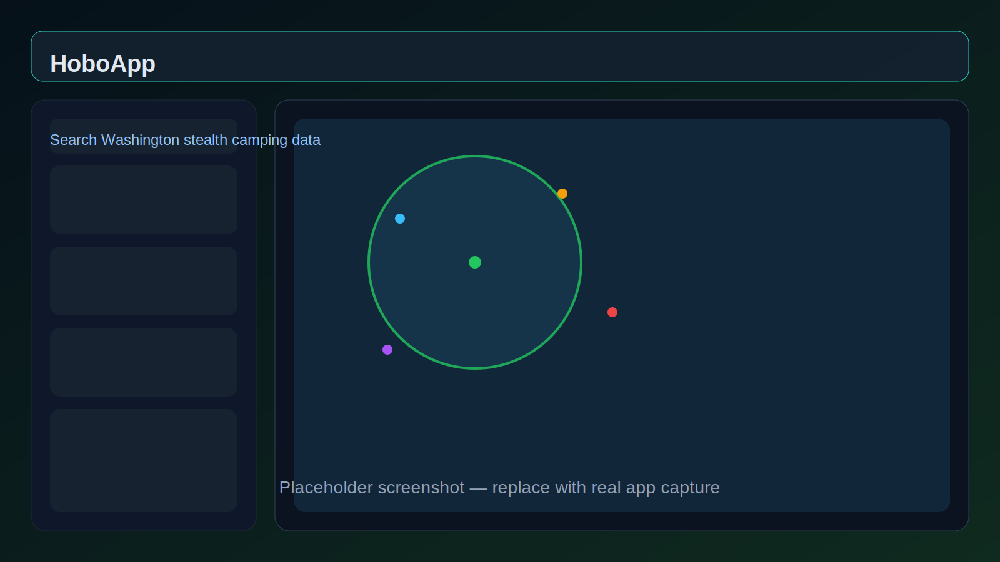
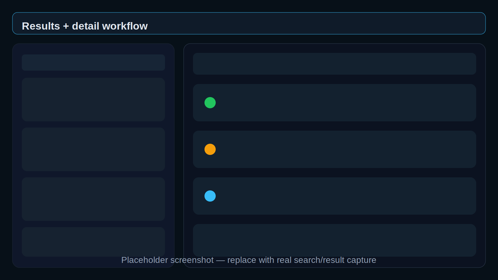
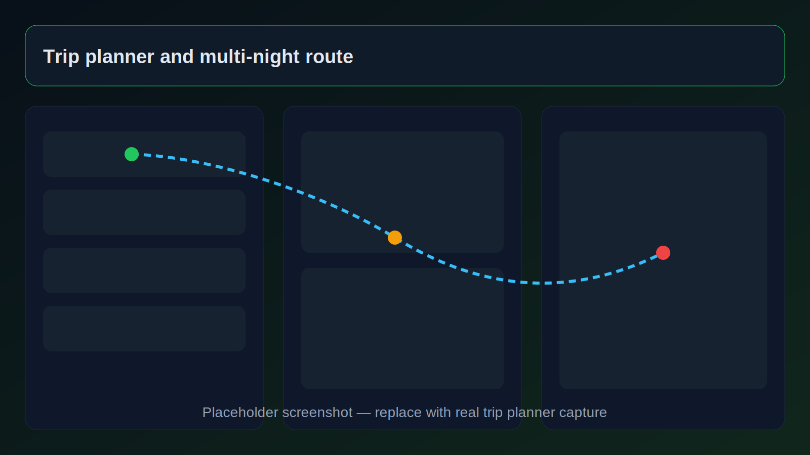

# HoboApp

**HoboApp** is an open-source Electron desktop app for researching stealth camping, shelter, hygiene, food, transit, weather, and survival resources across Washington State.
It pulls together public data sources, curated field data, and planning tools into one fast desktop map interface designed for stealth campers, van dwellers, rough travelers, and nomads.

> Research tool only. Not a guarantee of safety, legality, access, or suitability.

---

## Overview

HoboApp helps you search around an address, city, or coordinates and quickly surface nearby:
- stealth camping candidates
- campgrounds and public land sites
- bridge and overpass shelter spots
- bathrooms and showers
- water, food banks, libraries, laundry, and other survival resources
- grocery options and budget meal ideas
- transit routes and nearby agencies
- weather, terrain, and elevation intel
- waterways, woods, rain cover, and sketch/crime indicators
- EV charging and van-life support stops
- custom user-added spots with notes and photos

---

## Screenshots

### Main map and search


### Search results and location research


### Trip planning workflow


> Replace these placeholder images with real screenshots from the app when ready.

---

## Key features

### Interactive desktop map
- Leaflet-based map UI
- dark and light themes
- satellite imagery toggle
- clustered markers for large result sets
- heatmap overlays, including crime/sketch heatmap support
- source-by-source progress tracking during search

### Multi-source location search
HoboApp queries many public and curated sources, normalizes the returned records, deduplicates overlapping spots, and presents them in a single searchable map/list workflow.

### Survival and field utilities
- **Bathrooms & showers** lookup
- **Bridge shelter** finder
- **Resource search** for water, food, libraries, laundry, WiFi, and more
- **Transit & directions** support
- **Weather, elevation, and terrain** analysis before heading out

### Food and budget planning
- nearby grocery store search
- food bank lookup
- nutrition lookup
- quick meal planning
- budget meal optimization helpers

### Personal planning tools
- favorites
- saved notes
- recent searches
- custom spots
- local trip plans
- custom spot photo attachments
- local settings and optional API key storage

### Export and portability
- export filtered results to **GPX**

---

## Data sources

HoboApp combines multiple public APIs, OpenStreetMap-derived layers, curated datasets, and custom parsers.

Integrated sources include:

- RIDB / Recreation.gov
- OpenStreetMap / Overpass
- FreeCampsites.net
- iOverlander
- FHWA bridge data + OSM bridge queries
- restroom and shower datasets
- survival resources from OSM
- USFS recreation opportunities
- National Park Service data
- OpenChargeMap
- waterways and woods datasets
- rain-cover / overhead shelter data
- crime / sketch-area indicators
- built-in curated Washington State locations
- Reddit search for local stealth camping intel
- weather and elevation analysis services

Some integrations work without keys. Some optional providers are better when API keys are configured in-app.

---

## Tech stack

- **Electron**
- **Node.js**
- **Leaflet**
- **Chart.js**
- **Toastify**
- **Tippy.js**
- **Day.js**
- **Axios**
- **Cheerio**
- **NodeCache**

---

## Installation

### Requirements
- Node.js
- npm
- Linux, macOS, or Windows capable of running Electron

### Run locally

```bash
npm install
npm start
```

### Development mode

```bash
npm run dev
```

---

## Repository layout

- [package.json](package.json) — app metadata and scripts
- [src/main.js](src/main.js) — Electron main process and IPC orchestration
- [src/preload.js](src/preload.js) — secure renderer bridge
- [src/renderer.js](src/renderer.js) — main application UI logic
- [src/index.html](src/index.html) — app shell and modal layout
- [src/styles.css](src/styles.css) — styling and animations
- [src/modules](src/modules) — source adapters and utilities

Notable modules:

- [src/modules/ridb.js](src/modules/ridb.js)
- [src/modules/freecampsites.js](src/modules/freecampsites.js)
- [src/modules/ioverlander.js](src/modules/ioverlander.js)
- [src/modules/bathrooms.js](src/modules/bathrooms.js)
- [src/modules/bridges.js](src/modules/bridges.js)
- [src/modules/resources.js](src/modules/resources.js)
- [src/modules/grocery.js](src/modules/grocery.js)
- [src/modules/transit.js](src/modules/transit.js)
- [src/modules/weather.js](src/modules/weather.js)
- [src/modules/terrain.js](src/modules/terrain.js)
- [src/modules/nps.js](src/modules/nps.js)
- [src/modules/openchargemap.js](src/modules/openchargemap.js)

---

## Privacy

HoboApp stores user data locally in Electron's app data directory, including:

- favorites
- notes
- recent searches
- custom locations
- trip plans
- settings
- optional API keys
- custom spot photos

This repo does not include a hosted sync backend for that personal data.

---

## Safety and legal notice

This project is for **informational and educational use only**.

Outdoor sleeping, stealth camping, trespassing, and remote travel carry real risk, including injury, arrest, property loss, and death. Data may be incomplete, stale, inaccurate, unsafe, or legally unusable. Always verify conditions, land ownership, weather, access rules, and local laws yourself.

Use HoboApp at your own risk.

---

## Project status

The public project name is **HoboApp**, but some internal code and UI strings still use older names such as **HoboCamp** and **GhostCamp**.

---

## Contributing

Issues and pull requests are welcome.

Helpful contribution areas:

- improving source quality and deduplication
- adding support beyond Washington State
- better offline caching
- stronger filtering and safety scoring
- renderer performance and UI polish
- packaging and release automation
- replacing placeholder screenshots with real captures

---

## License

See [LICENSE](LICENSE) for the full project license.
